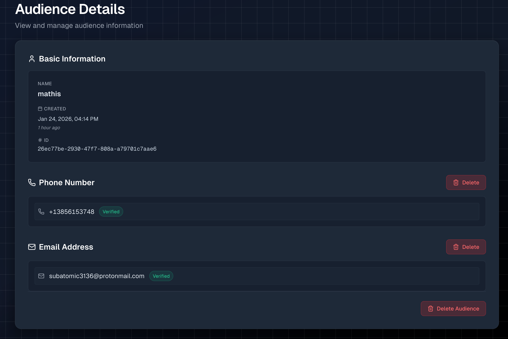
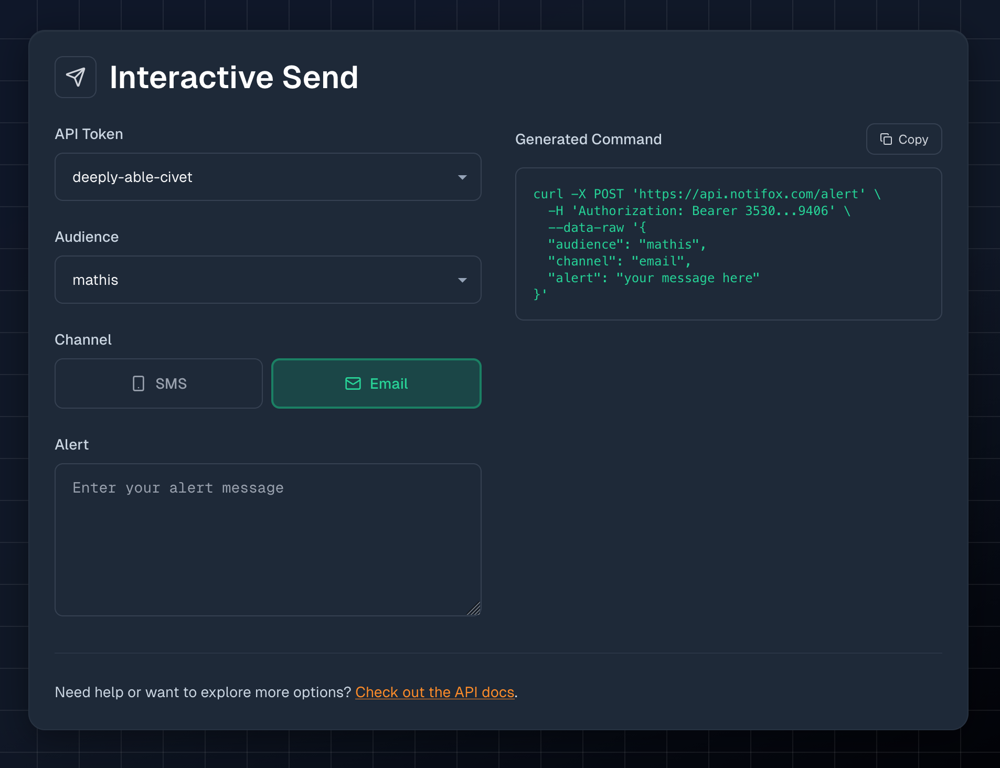

Several months ago we released the Notifox API as an MVP. The pain point that made us start Notifox was SMS, so that was our primary focus. Once we released it and let the dust settle, we realized that to really "platformize" Notifox, we needed to expand beyond just SMS.

While dogfooding [Notifox](https://notifox.com) (using our own product), it became clear that SMS covered the "urgent" side of alerts. But any alert that was less urgent, or bigger than several hundred characters (multiple SMS parts), deserved its own channel. It didn't take long to figure out which channel we wanted to integrate next!

**That's why we're proud to announce the Email channel! Now available to anyone on [Notifox](https://notifox.com)!**

<!-- truncate -->

Watch the announcement DevLog here:
<iframe width="560" height="315" src="https://www.youtube.com/embed/cqM6MDFmnfw?si=-YsYCANOcDVl_fJ6" title="YouTube video player" frameborder="0" allow="accelerometer; autoplay; clipboard-write; encrypted-media; gyroscope; picture-in-picture; web-share" referrerpolicy="strict-origin-when-cross-origin" allowfullscreen></iframe>

## The Technical Journey

As we started working on the email integration, we quickly realized that the original alerts architecture and database schemas were designed around sending SMS messages. To make this integration (and future ones) easier, we decided to redesign the audience and alerts system from the ground up. I briefly mentioned this in [our first devlog](https://youtu.be/uAZOVoWBZqg). Because of the total overhaul, releasing the email channel took longer than expected. But it's finally here, and it's pretty good!

## Why Email is Great

The email channel is considerably cheaper than SMS at **just $0.001 per alert**. That means with $1 you can send up to 1,000 alerts via email. Not only is it cheaper, but it also has way more flexibility in terms of length and encoding. SMS alerts are limited to ~765 characters (5 SMS parts), but email alerts can be up to 50,000 characters in UTF-8 encoding.

You can read more about the specifics in the [Alerts API reference](/docs/reference/alerts-api#channel-comparison).

## Adding Email to Your Audiences

To allow users to send emails, we first needed to let them add and verify email addresses. To make this user-friendly, we improved the audience verification modals.



As you can see above, both phone numbers and email addresses are configurable in the audience details. They're verified the exact same way: you enter your phone number or email, and we send you a verification code. Once you verify it, you're ready to start sending alerts. Simple and straightforward.

## Using the SDKs

My favorite thing about how channels work is how easy it is to switch between them. The core inputs for SMS and email are identical, so switching channels when sending an alert is super simple. Here's some Python code sending an alert via both channels using the [notifox package](https://pypi.org/project/notifox/):

```python
alert = "Primary database server is down!"

#Send via SMS
response = client.send_alert(
    audience="mike",
    alert=alert,
    channel=notifox.SMS # SMS
)

# Send via Email
response = client.send_alert(
    audience="mike",
    alert=alert,
    channel=notifox.Email #Email
)
```

Here's a snippet of Go that does the same:
```go
alert := "Critical system failure!"

resp, err := client.SendAlert(ctx, notifox.AlertRequest{
    Audience: "admin",
    Alert:    alert,
    Channel:  notifox.SMS, // SMS
})

resp, err := client.SendAlert(ctx, notifox.AlertRequest{
    Audience: "admin",
    Alert:    alert,
    Channel:  notifox.Email, // Email
})
```

We've updated both the [Python](https://pypi.org/project/notifox/) and [Go](https://pkg.go.dev/github.com/notifoxhq/notifox-go) packages to support the new channel parameter, and we've also improved the Interactive Send tool in the [Notifox console](https://console.notifox.com).



If you have both SMS and email channels configured and verified, you can effortlessly switch between them right in the console! It really shows how easy the Notifox API is to use.

## What's Next?

With both SMS and email channels now available, you have the flexibility to choose the right channel for each alert. Use SMS for urgent, time-sensitive notifications, and email for detailed reports, logs, or non-critical updates. The best part? You can configure both channels on the same audience and switch between them with a single parameter change.

Whether you're monitoring server health, tracking deployment status, or sending detailed error reports, the email channel gives you the power to send longer, more detailed alerts at a fraction of the cost of SMS.

**Ready to try it out?** [Sign up for Notifox](https://console.notifox.com) and send your first email alert today. If you're already using Notifox, the email channel is available right now. Just verify an email address to any audience in your [console](https://console.notifox.com/?view=audiences).

Have questions or feedback? We'd love to hear from you! Reach out on [GitHub](https://github.com/notifoxhq), [Discord](https://discord.gg/ZSp5SzxJBF), or email us at support@notifox.com.