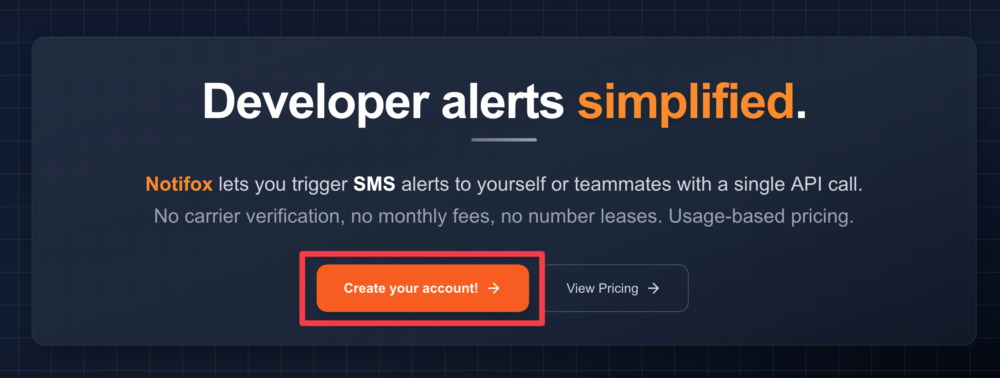

# Create an account

To create an account, go to [https://notifox.com](https://notifox.com) and click on "Create your Account".

You can create an account using your Github account by clicking the "Continue with GitHub" button. If you go this route, to sign-in next time, also click on the "Continue with GitHub" button.

Alternatively you can create an account using your email address and password by clicking "Sign Up".

If chosen to create an account using your email address, we will ask for your first name, last name and email. You'll then be asked to enter a password. Finally we will ask you to verify the email address you've provided. You should receive an email with a 6 digit code.

## Reference Documentation

For more details about accounts and the data model:
* [Data Model](/docs/reference/data-model) - Complete overview of accounts, API tokens, audiences, and alerts
