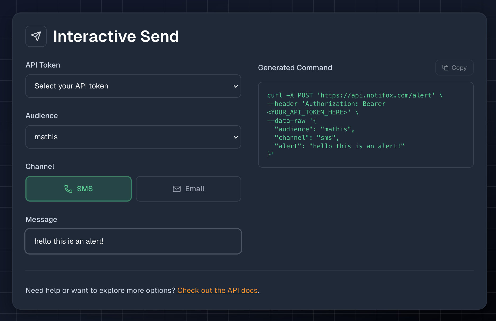

# Sending an Alert

Now that you have an account, API token, and verified audience, you're ready to send your first alert!

## What Are Alerts?

Alerts are messages you send through the Notifox API. Notifox supports two channels:

* **SMS** - Text messages sent to phone numbers
* **Email** - Emails sent to email addresses

They're perfect for:
* Notifying yourself or your team about server issues
* Sending critical system alerts
* Getting notified about important events in your application

## Choosing a Channel

When sending an alert, you can specify the `channel` parameter:

| Channel | Cost | Max Length | Best For |
|---------|------|------------|----------|
| `sms` | $0.025/part | ~765 chars (5 parts) | Urgent, time-sensitive alerts |
| `email` | $0.001/email | 50,000 chars | Detailed alerts, logs, reports |

**Note:** The channel you choose must be configured for the audience. For example, if you want to send an email, the audience must have a verified email address.

## Your First Alert

### Using the Console (Easiest Way)

The easiest way to send your first alert is using the Interactive Send feature in the Notifox console:

1. Navigate to the [Send](https://console.notifox.com/?view=send) tab in your Notifox console
2. Select an API token from the dropdown
3. Choose an audience from the list of verified audiences
4. Select a channel (SMS or Email)
5. Type your alert message
6. Copy the generated curl command or use it as reference



This is perfect for testing and sending quick alerts without writing any code. The console shows you the curl command, so you can copy it for use in your own scripts.

### Sending an SMS

```bash
curl -X POST https://api.notifox.com/alert \
  -H "Authorization: Bearer YOUR_API_TOKEN" \
  -H "Content-Type: application/json" \
  -d '{
    "audience": "joe",
    "channel": "sms",
    "alert": "Server is down!"
  }'
```

The recipient will receive an SMS: **"Notifox: Server is down!"**

Response:
```json
{
  "message_id": "123e4567-e89b-12d3-a456-426614174000",
  "parts": 1,
  "cost": 0.025,
  "currency": "USD",
  "encoding": "GSM-7",
  "characters": 24
}
```

### Sending an Email

```bash
curl -X POST https://api.notifox.com/alert \
  -H "Authorization: Bearer YOUR_API_TOKEN" \
  -H "Content-Type: application/json" \
  -d '{
    "audience": "joe",
    "channel": "email",
    "alert": "Server CPU usage exceeded 90%\n\nDetails:\n- Server: prod-web-01\n- CPU: 94%\n- Memory: 78%"
  }'
```

The recipient will receive an email with:
* **Subject**: Auto-generated from the first line (e.g., "Notifox: Server CPU usage exceeded 90%")
* **Body**: Your full message with a footer disclaimer

Response:
```json
{
  "message_id": "123e4567-e89b-12d3-a456-426614174000",
  "parts": 1,
  "cost": 0.001,
  "currency": "USD",
  "encoding": "UTF-8",
  "characters": 89
}
```

## Response Fields

| Field | Description |
|-------|-------------|
| `message_id` | Unique identifier for your alert (UUID) |
| `parts` | Number of parts (always 1 for email, 1-5 for SMS) |
| `cost` | Cost in USD |
| `currency` | Always "USD" |
| `encoding` | `"GSM-7"` or `"UCS-2"` for SMS, `"UTF-8"` for email |
| `characters` | Number of characters in your message |

## Using an SDK

If you're using Python or Go, you can use the Notifox SDKs for a simpler experience:

### Python

```python
import notifox

client = notifox.NotifoxClient(api_key="your_api_token")

# Send SMS
response = client.send_alert(
    audience="joe",
    alert="Server is down!",
    channel=notifox.SMS
)

# Send Email
response = client.send_alert(
    audience="joe",
    alert="Detailed error report...",
    channel=notifox.Email
)
```

### Go

```go
package main

import (
    "context"
    "github.com/notifoxhq/notifox-go"
)

func main() {
    client, _ := notifox.NewClientFromEnv() // Reads from NOTIFOX_API_KEY
    ctx := context.Background()
    
    // Send SMS (simpler method - defaults to SMS)
    resp, _ := client.SendAlert(ctx, "joe", "Server is down!")
    
    // Send Email (requires SendAlertWithOptions to specify channel)
    resp, _ := client.SendAlertWithOptions(ctx, notifox.AlertRequest{
        Audience: "joe",
        Alert:    "Detailed error report...",
        Channel:  notifox.Email,
    })
}
```

The SDKs handle all the HTTP details for you. See the [Languages](/docs/languages/python) section for SDK documentation.

## Next Steps

Now that you can send alerts, you might want to learn about:
* [How SMS parts and costs work](/docs/reference/parts) - Understanding SMS parts and pricing
* [Complete API reference](/docs/reference/alerts-api) - Detailed documentation for all options and error handling
* [Language SDKs](/docs/languages/python) - Using Notifox with Python, Go, and other languages