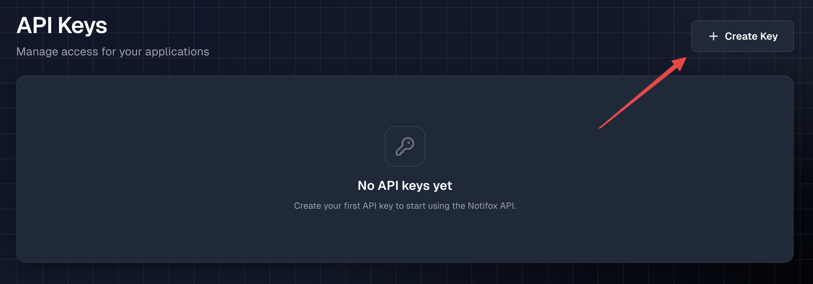
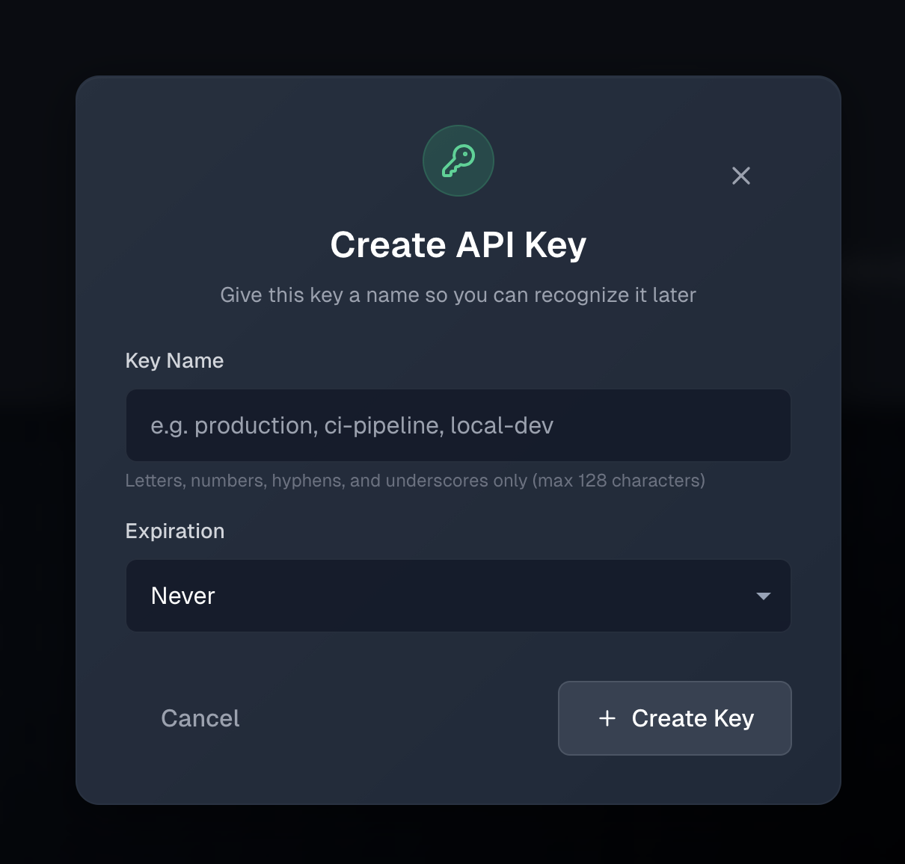
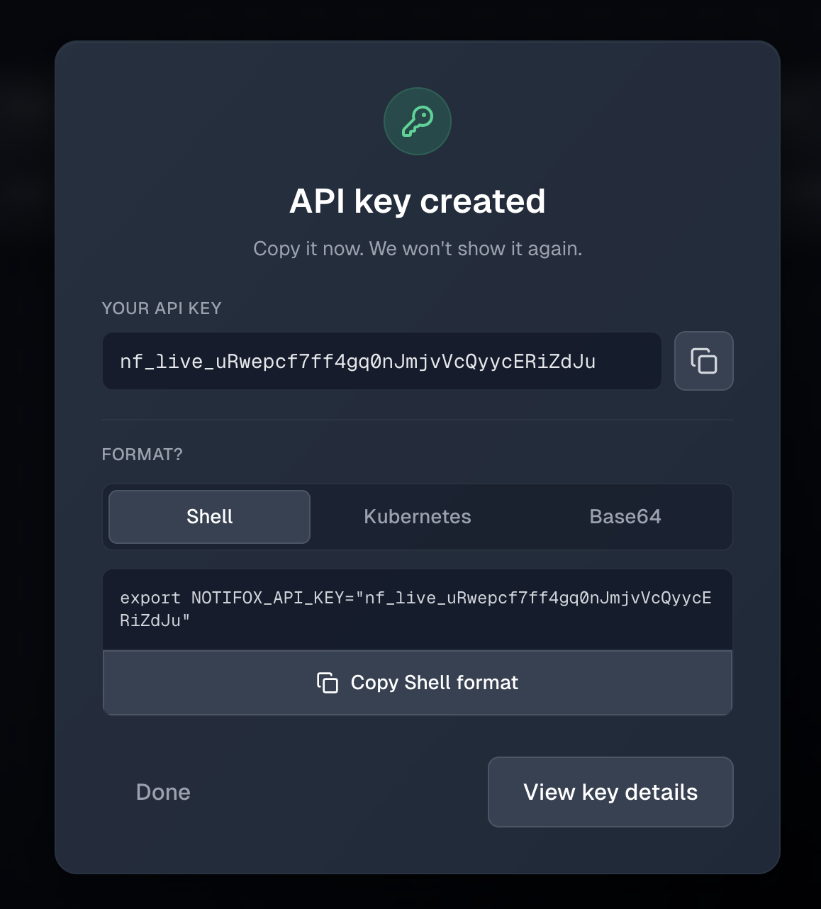
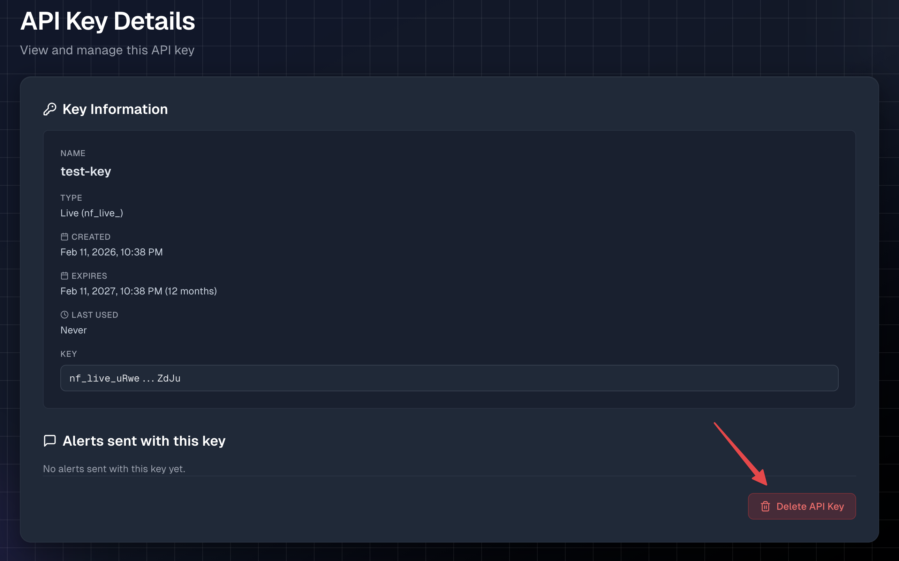

# Create an API key

An **API key** is a secret string used to authenticate all requests to the Notifox API.

**Important:** 
- API keys are secrets: treat them like passwords
- Each key is shown only once when created
- You can create up to 1,000 active API keys per account
- Keys can have an optional expiration (Never, 30 days, 90 days, 1 year, or 2 years)

## Key types

| Type | Prefix | Use case |
|------|--------|----------|
| **Live** | `nf_live_` | Long-lived production keys. Example: `nf_live_R8iNrYG2P6lgRdZkjFm3Mdk1c8uvDcNE` |
| **Temp** | `nf_temp_` | Short-lived keys for testing. Valid for 5 minutes or 10 sends (SMS + email combined), whichever comes first. **Only created in the [Interactive Send](https://console.notifox.com/?view=send) menu**; you cannot create them from the API Keys tab. |
| **Legacy** | (none) | Pre-migration keys (UUID format). Still supported indefinitely; we recommend replacing them with new live keys when convenient. |

## Creating an API key

To create a **live** API key, visit the [API Keys](https://console.notifox.com/?view=key) tab in the Notifox console. If you don't have any keys yet, you'll see an empty state with a **+ Create Key** button.



Click **+ Create Key** to open the creation modal. Enter a **Key Name** (e.g. `production`, `ci-pipeline`, `local-dev`; letters, numbers, hyphens, and underscores only, max 128 characters) and optionally choose an **Expiration** (Never, 30 days, 90 days, 1 year, or 2 years). Then click **Create Key**.



The console will generate a key and show it once in the "API key created" dialog.

:::danger
Do <strong>NOT</strong> share this key with anyone. Anyone with access to this key can use the API to send alerts on your behalf.
:::

Copy the key using the copy icon next to **YOUR API KEY**, or use **Copy Shell format** to copy the full `export NOTIFOX_API_KEY="..."` command. **Copy it now. We won't show it again.** Once you leave this dialog, the full key cannot be retrieved from the dashboard, so save it in a secure location.



You can then click **View key details** to see the key in your list (masked) or **Done** to close. You're ready to use your Notifox API key.

:::tip
The Notifox CLI and SDKs try reading from the `NOTIFOX_API_KEY` environment variable when initializing the client. Use **Copy Shell format** in the dialog or set the variable yourself so you don't have to hard-code the API key.

```bash
export NOTIFOX_API_KEY='your-key-here'
```
:::

## Viewing your API keys

You can view all your existing API keys in the [API Keys](https://console.notifox.com/?view=key) tab. Click a key to open **API Key Details**, where you can see its name, type (e.g. Live), created and expiration dates, last used, and alerts sent. For security, the key value is shown only in masked form (first and last few characters); the full key is shown only once when you create it.

## Key limits

| Limit | Value | Scope |
|-------|-------|--------|
| API keys per account | 1,000 | Active (non-deleted) keys |
| Temp key sends | 10 | Total alerts (SMS + email) per temp key |
| Key name length | 1–128 characters | Letters, numbers, hyphens, underscores only (`[A-Za-z0-9_-]+`) |

If you reach the 1,000-key limit, delete unused keys first or contact [support@notifox.com](mailto:support@notifox.com) if you need a higher limit. Each key can be used independently; use separate keys for different applications or environments (production, staging, development).

## Deleting an API key

To delete an API key (for example because it was compromised or no longer needed), open the [API Keys](https://console.notifox.com/?view=key) tab, click the key to open **API Key Details**, then click the red **Delete API Key** button at the bottom of the page.

Keep in mind that once you delete an API key, it can no longer be used. Any requests made with a deleted API key will return a `401 Not Authorized` status code.



## Best Practices

* **Store keys securely**: Never commit API keys to version control. Use environment variables or secret management tools.
* **Rotate keys regularly**: Periodically delete old keys and create new ones, especially if you suspect a key may have been compromised.
* **Use different keys for different environments**: Create separate keys for production, staging, and development to better track usage and limit blast radius if one is compromised.
* **Don't share keys**: API keys grant full access to send alerts from your account. Only share keys with trusted team members who need API access.
* **Delete unused keys**: Remove keys that are no longer in use to reduce your attack surface.

## Reference Documentation

For more details about API keys and authentication:
* [Data Model](/docs/reference/data-model) - Overview of API keys and other core objects
* [Alerts API Reference](/docs/reference/alerts-api) - API authentication and error handling
