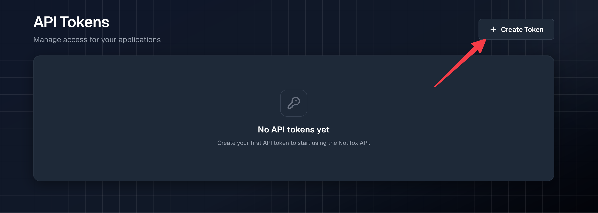
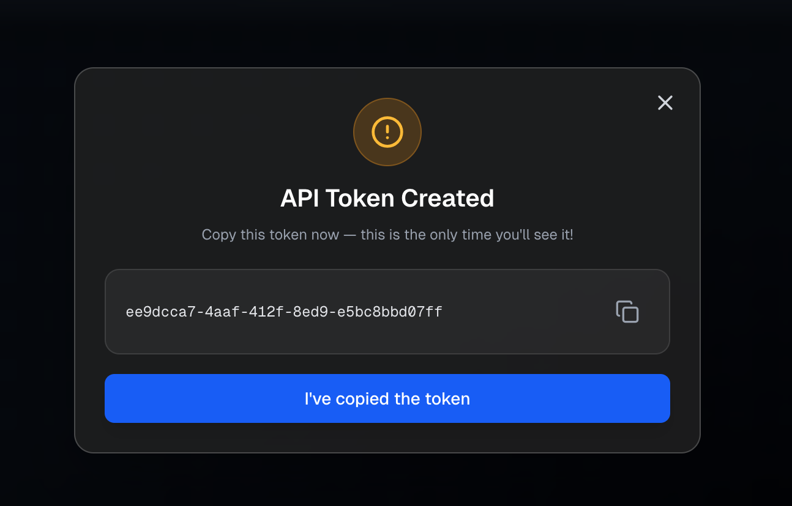
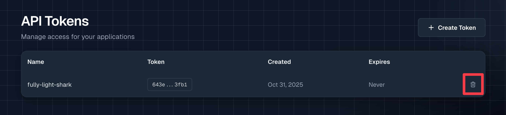

# Create an API token

An **API token** (also called API key) is a secret string used to authenticate all requests to the Notifox API.

**Important:** 
- API tokens are secrets: treat them like passwords
- Each token is shown only once when created
- You can create up to 10 API tokens per account
- Tokens don't expire unless you delete them

## Creating an API token

To create an API token, visit the [API Tokens](https://console.notifox.com/?view=token) tab in the Notifox console.

Then click on "Create Token" to generate an API Token.



This will generate an API token for you.

:::danger
Do <strong>NOT</strong> share this token with anyone. Anyone with access to this token can use the API to send alerts on your behalf.
:::

Copy the token by pressing the copy icon on the right. Once you press the blue button, you will not be able to retrieve the API token from the Notifox dashboard, so save it in a secure location.



You are now ready to use your Notifox API token!

:::tip
All Notifox SDKs try reading from the `NOTIFOX_API_KEY` environment variable when initializing the client. Set the environment variable so you don't have to hard-code the API key!

```bash
export NOTIFOX_API_KEY='your-key-here'
```
:::

## Viewing Your API Tokens

You can view all your existing API tokens in the [API Tokens](https://console.notifox.com/?view=token) tab. For security reasons, tokens are displayed in a masked format (showing only the first and last few characters). The full token is only shown once when you create it.

## Token Limits

* **Maximum of 10 API tokens per account**: If you need to create a new token and have reached the limit, delete an unused token first. If your use-case requires a higher limit, please contact [support@notifox.com](mailto:support@notifox.com).
* Each token can be used independently: Create separate tokens for different applications or environments (production, staging, development).

## Deleting an API token

If you want to delete an API token (because it was compromised, or no longer needed), go to the [API Tokens](https://console.notifox.com/?view=token) tab in the Notifox console and click on the trash icon in the row of the token you want to delete.

Keep in mind that once you delete an API token, it can no longer be used. Any requests made with a deleted API token will return a `401 Not Authorized` status code.



## Best Practices

* **Store tokens securely**: Never commit API tokens to version control. Use environment variables or secret management tools.
* **Rotate tokens regularly**: Periodically delete old tokens and create new ones, especially if you suspect a token may have been compromised.
* **Use different tokens for different environments**: Create separate tokens for production, staging, and development to better track usage and limit blast radius if one is compromised.
* **Don't share tokens**: API tokens grant full access to send alerts from your account. Only share tokens with trusted team members who need API access.
* **Delete unused tokens**: Remove tokens that are no longer in use to reduce your attack surface.

## Reference Documentation

For more details about API tokens and authentication:
* [Data Model](/docs/reference/data-model) - Overview of API tokens and other core objects
* [Alerts API Reference](/docs/reference/alerts-api) - API authentication and error handling