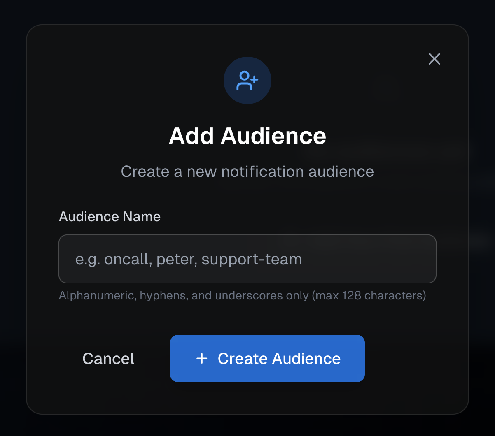
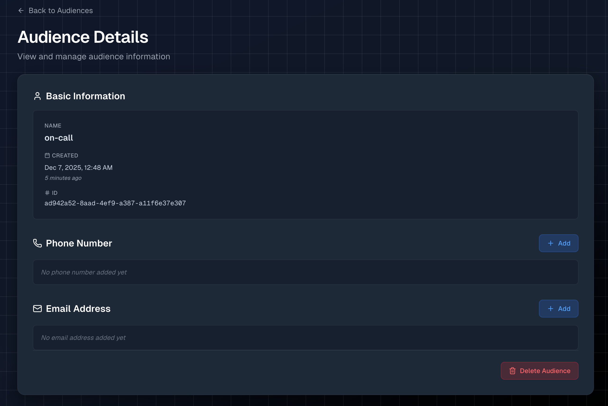
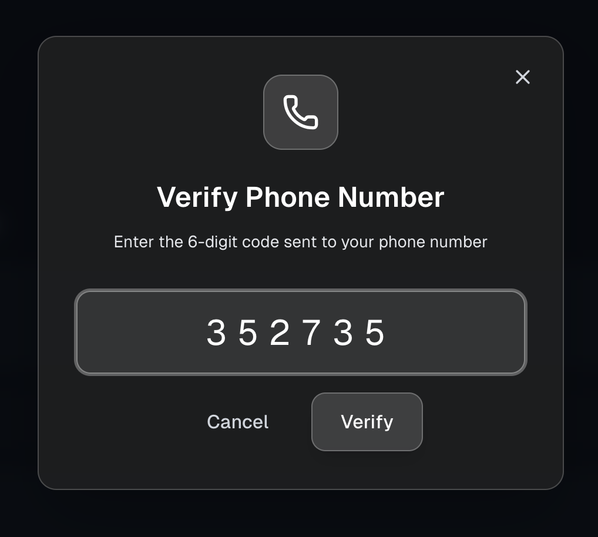
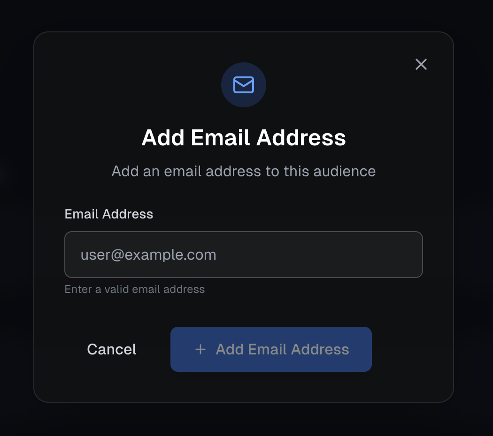
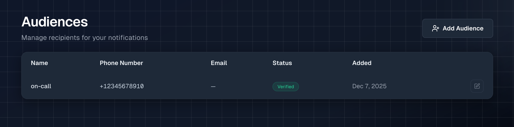

# Create an Audience

Audiences are how you tell Notifox who should receive your alerts. Think of an audience as a named contact—like "joe", "oncall" or "dev-team" that you can reference when sending alerts.

Each audience can have:
* A **phone number** for SMS alerts
* An **email address** for email alerts
* Or both!

Let's create your first audience together.

## Step 1: Give it a name

Head over to the [Audiences](https://console.notifox.com/?view=audiences) page and click the **Add Audience** button.

You'll see a simple form asking for an audience name. Choose something descriptive that you'll remember—like `oncall`, `dev-team`, or `support`. The name can include letters, numbers, hyphens, and underscores, but no spaces.

Click **Create Audience** when you're ready. You'll automatically be taken to the detailed view for your new audience.

## Step 2: Add contact methods

Now you need to add a way to reach this audience. You can add a phone number, an email address, or both.

### Adding a Phone Number (for SMS)

In the detailed view, you'll see a **Phone Number** section with an **Add** button. Click it.

Enter your US phone number (it should start with `+1`). The form will help you format it correctly. You'll also see a brief message about SMS alerts—this is required for compliance.

Click **Add Phone Number**. Notifox will automatically send a 6-digit verification code to that number via SMS.

A verification window will pop up automatically. Check your phone for the 6-digit code, then enter it in the prompt.

Once you've entered all 6 digits, you can press **Enter** to submit. If the code is correct, your phone number will be verified!

**Tip:** If you don't receive the code, you can delete the phone number and try adding it again.

### Adding an Email Address (for Email)

In the detailed view, you'll also see an **Email** section with an **Add** button. Click it.

Enter the email address you want to receive alerts at. Click **Add Email**. Notifox will send a verification email to that address.

Check your inbox for the verification email and click the link inside to verify. Once verified, you can send email alerts to this audience.

**Tip:** Check your spam folder if you don't see the verification email.

## That's it!

Your audience is now ready to use. You'll see it listed on the [Audiences](https://console.notifox.com/?view=audiences) page with verification status for each contact method.

You can click the edit icon (pencil) next to any audience to manage it—add or remove phone numbers and email addresses, or delete the audience entirely.

## Which channel to use?

| Channel | Best For | Cost |
|---------|----------|------|
| SMS | Urgent, time-sensitive alerts that need immediate attention | $0.025/part |
| Email | Detailed alerts, logs, reports, or non-urgent notifications | $0.001/email |

You can configure both channels on the same audience and choose which one to use when sending each alert.

**What's next?** Now that you have an audience set up, you're ready to [add some funds](./adding-funds.md) and send your first alert!